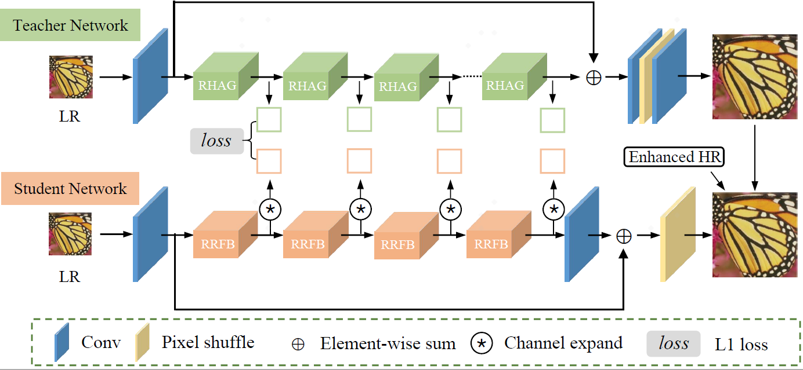

[# [NTIRE 2023 Challenge on Efficient Super-Resolution](https://cvlai.net/ntire/2023/) @ [CVPR 2023](https://cvpr2023.thecvf.com/)
# DIPNet 
This repository contains the source code for our paper:

[DIPNet: Efficiency Distillation and Iterative Pruning for Image Super-Resolution](https://arxiv.org/pdf/2304.07018)<br/>
CVPRW 2023 <br/>
Lei Yu, Xinpeng Li, Youwei Li, Ting Jiang, Qi Wu, Haoqiang Fan, Shuaicheng Liu<br/>



## How to test the model?

1. `git clone [https://github.com/ofsoundof/NTIRE2023_ESR.git](https://github.com/xiumu00/DIPNet.git)`
2. Select the model you would like to test from [`run.sh`](./run.sh)
    ```bash
    CUDA_VISIBLE_DEVICES=0 python test_demo.py --data_dir [path to your data dir] --save_dir [path to your save dir] --model_id 0
    ```
    - Be sure the change the directories `--data_dir` and `--save_dir`.
   
## How to calculate the number of parameters, FLOPs, and activations

```python
    from utils.model_summary import get_model_flops, get_model_activation
    from models.team00_RFDN import RFDN
    model = RFDN()
    
    input_dim = (3, 256, 256)  # set the input dimension
    activations, num_conv = get_model_activation(model, input_dim)
    activations = activations / 10 ** 6
    print("{:>16s} : {:<.4f} [M]".format("#Activations", activations))
    print("{:>16s} : {:<d}".format("#Conv2d", num_conv))

    flops = get_model_flops(model, input_dim, False)
    flops = flops / 10 ** 9
    print("{:>16s} : {:<.4f} [G]".format("FLOPs", flops))

    num_parameters = sum(map(lambda x: x.numel(), model.parameters()))
    num_parameters = num_parameters / 10 ** 6
    print("{:>16s} : {:<.4f} [M]".format("#Params", num_parameters))
```
