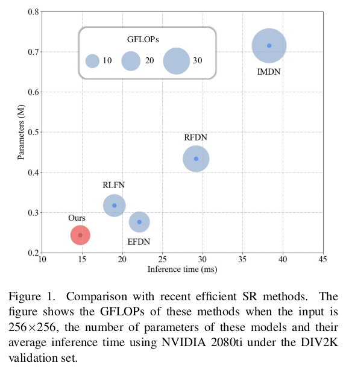

# [NTIRE 2023 Challenge on Efficient Super-Resolution](https://cvlai.net/ntire/2023/) @ [CVPR 2023](https://cvpr2023.thecvf.com/)
# DIPNet 
This repository contains the source code for our paper:

[DIPNet: Efficiency Distillation and Iterative Pruning for Image Super-Resolution](https://arxiv.org/pdf/2304.07018)<br/>
CVPRW 2023 <br/>
Lei Yu, Xinpeng Li, Youwei Li, Ting Jiang, Qi Wu, Haoqiang Fan, Shuaicheng Liu<br/>

## Abstract
Efficient deep learning-based approaches have achieved remarkable performance in single image super-resolution.
However, recent studies on efficient super-resolution have mainly focused on reducing the number of parameters and
floating-point operations through various network designs. Although these methods can decrease the number of parameters and floating-point operations, they may not nec-
essarily reduce actual running time. To address this issue, we propose a novel multi-stage lightweight network boosting method, which can enable lightweight networks to
achieve outstanding performance. Specifically, we leverage enhanced high-resolution output as additional supervision
to improve the learning ability of lightweight student networks. Upon convergence of the student network, we further
simplify our network structure to a more lightweight level using reparameterization techniques and iterative network
pruning. Meanwhile, we adopt an effective lightweight network training strategy that combines multi-anchor distilla-
tion and progressive learning, enabling the lightweight network to achieve outstanding performance. Ultimately, our
proposed method achieves the fastest inference time among all participants in the NTIRE 2023 efficient super-resolution
challenge while maintaining competitive super-resolution performance. Additionally, extensive experiments are con-
ducted to demonstrate the effectiveness of the proposed components. The results show that our approach achieves
comparable performance in representative dataset DIV2K, both qualitatively and quantitatively, with faster inference
and fewer number of network parameters.


## Overview Architecture


## Training
We provide our pretrained model weights. We are organizing the training code and it will be released soon. 

## Quick test
How to test the model?

1. `git clone [https://github.com/ofsoundof/NTIRE2023_ESR.git](https://github.com/xiumu00/DIPNet.git)`
2. Select the model you would like to test from [`run.sh`](./run.sh)
    ```bash
    CUDA_VISIBLE_DEVICES=0 python test_demo.py --data_dir [path to your data dir] --save_dir [path to your save dir] --model_id 0
    ```
    - Be sure the change the directories `--data_dir` and `--save_dir`.
   
How to calculate the number of parameters, FLOPs, and activations

```python
    from utils.model_summary import get_model_flops, get_model_activation
    from models.team00_RFDN import RFDN
    model = RFDN()
    
    input_dim = (3, 256, 256)  # set the input dimension
    activations, num_conv = get_model_activation(model, input_dim)
    activations = activations / 10 ** 6
    print("{:>16s} : {:<.4f} [M]".format("#Activations", activations))
    print("{:>16s} : {:<d}".format("#Conv2d", num_conv))

    flops = get_model_flops(model, input_dim, False)
    flops = flops / 10 ** 9
    print("{:>16s} : {:<.4f} [G]".format("FLOPs", flops))

    num_parameters = sum(map(lambda x: x.numel(), model.parameters()))
    num_parameters = num_parameters / 10 ** 6
    print("{:>16s} : {:<.4f} [M]".format("#Params", num_parameters))
```

## Citations
If our code helps your research or work, please consider citing our paper. The following is a BibTeX reference.
```bash
@inproceedings{yu2023dipnet,
  title={DIPNet: Efficiency Distillation and Iterative Pruning for Image Super-Resolution},
  author={Yu, Lei and Li, Xinpeng and Li, Youwei and Jiang, Ting and Wu, Qi and Fan, Haoqiang and Liu, Shuaicheng},
  booktitle={Proceedings of the IEEE/CVF Conference on Computer Vision and Pattern Recognition},
  pages={1692--1701},
  year={2023}
}
```
